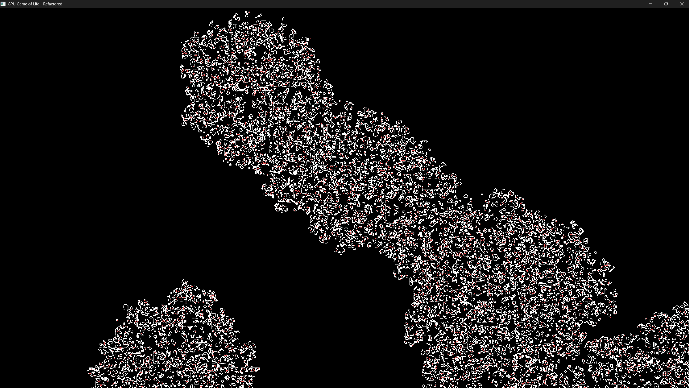
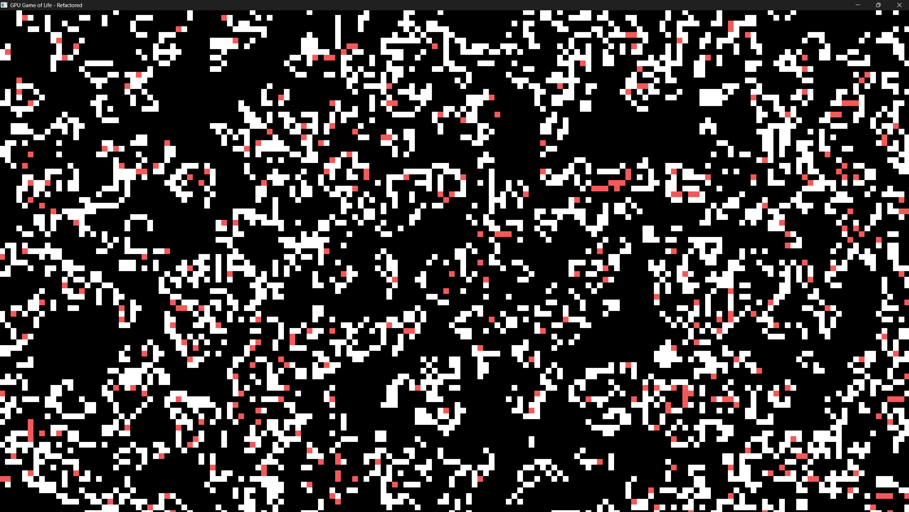

# 🌠 GPU of Life

A high-performance cellular automaton simulator powered by GPU compute shaders. This implementation of Conway's Game of Life runs entirely on your graphics card for blazing-fast simulation of large grids.

## 🖼️ Screenshots

### Random patterns with red "lucky" cells that survived death


### Creating shapes by painting with the mouse


## ✨ Features

- **GPU-Accelerated**: Utilizes WGPU compute shaders for massively parallel simulation
- **Interactive**: Paint living cells with your mouse
- **GUI Controls**: In-app menu (top-left button) for configuration
  - Toggle "Lucky Cell" rule
  - Adjust lucky cell survival chance (0-100%)
  - Adjust brush size
- **Zoom & Pan**: Navigate across the simulation space
- **Configurable Rules**: Classic Conway's rules with customization options via GUI and shaders
- **Lucky Cells**: Configurable chance (default 10%) for dying cells to survive and turn red
- **Dynamic Rule System**: Hot-swappable shader rules that can be changed at runtime (TODO: GUI integration)
- **Modular Architecture**: Clean separation of rule definitions, patterns, and shader logic
- **API-Ready**: Designed to integrate with external APIs (like AI) for generating new rules

## 🎮 Controls

- **☰ (Top Left)**: Open/Close settings menu
- **Left Mouse Button**: Draw living cells
- **Right Mouse Button + Drag**: Pan around the grid
- **Mouse Wheel**: Zoom in/out
- **Escape**: Exit

## 🧬 Simulation Rules

This simulation follows Conway's Game of Life rules with an extra twist:

1. Any live cell with fewer than 2 live neighbors dies (underpopulation)
2. Any live cell with 2 or 3 live neighbors survives
3. Any live cell with more than 3 live neighbors dies (overpopulation)
4. Any dead cell with exactly 3 live neighbors becomes alive
5. **Special Rule**: When a cell would normally die, it has a configurable chance (default 10%) to survive and turn red. This rule can be toggled on/off via the settings menu.

The simulation provides ready-made presets (shader files):
- **Conway's Game of Life**: The classic ruleset (B3/S23)
- **HighLife**: A variant with self-replicating patterns (B36/S23)
- **Day & Night**: A complex ruleset with symmetric behavior (B3678/S34678)

## 🔧 Technical Details

Built with Rust and WGPU, this simulator leverages your GPU's parallel processing power:

- **Rust**: Safe, concurrent, and high-performance language
- **WGPU**: Cross-platform GPU compute and rendering
- **egui**: Immediate mode GUI library for settings menu
- **Compute Shaders**: WGSL code running directly on the GPU
- **Double Buffering**: Ping-pong buffer technique for cellular simulation
- **Dynamic Shader Compilation**: Ability to recompile and swap compute shaders at runtime

The simulation state is represented as:
- `0.0`: Dead cell (black)
- `1.0`: Live cell (white)
- `2.0`: Lucky cell that survived death (red)

### Modular Architecture

The project features a modular design for maximum flexibility:

- **Rule Parameters**: Separated into configurable structures for quick adjustment
- **Rule Definitions**: WGSL shader code can be swapped entirely at runtime
- **Pattern Library**: Predefined patterns (gliders, oscillators, etc.) available for initializing simulations
- **Dynamic Loading**: Infrastructure for loading new rule definitions during execution

## 🚀 Getting Started

### Requirements
- Rust 1.60+ and Cargo
- A GPU with support for compute shaders

### Building and Running

```bash
# Clone the repository
git clone https://github.com/yourusername/gpu-game-of-life.git
cd gpu-game-of-life

# Build and run in release mode (recommended for performance)
cargo run --release
```

## 🎯 Performance

The GPU implementation allows for real-time simulation of much larger grids than CPU-based approaches:

- Easily handles 1024×1024 grids at 60+ FPS on most modern GPUs
- Brush tool with adjustable size (via GUI) for easy pattern creation
- Efficient zoom and pan implementation for navigating large simulations
- Minimal performance impact when hot-swapping rule systems

## 🛠️ Future Improvements

- More patterns and presets
- Additional cellular automaton rule sets
- Statistics display (population, generation count)
- Simulation speed control
- Save/load functionality
- **GUI Shader Loading**: Implement "Load from file..." button in menu
- **GUI Rule Presets**: Connect rule preset buttons in menu to shader loading
- **AI Rule Generation**: Integration with AI services to create novel cellular automaton rules

## 📜 License

This project is licensed under the MIT License - see the LICENSE file for details.

---

Made with ❤️ using Rust, WGPU, and egui 